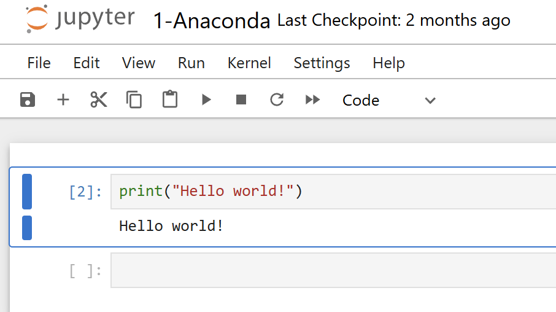
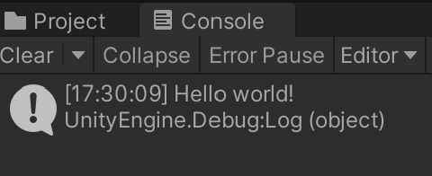

# АНАЛИЗ ДАННЫХ И ИСКУССТВЕННЫЙ ИНТЕЛЛЕКТ [in GameDev]
Отчет по лабораторной работе #1 выполнил(а):
- Маврешко Тимофей Кириллович
- РИ000024
Отметка о выполнении заданий (заполняется студентом):

| Задание | Выполнение | Баллы |
| ------ | ------ | ------ |
| Задание 1 | * | 60 |
| Задание 2 | * | 20 |
| Задание 3 | * | 20 |

знак "*" - задание выполнено; знак "#" - задание не выполнено;

Работу проверили:
- к.т.н., доцент Денисов Д.В.
- к.э.н., доцент Панов М.А.
- ст. преп., Фадеев В.О.

[](https://nodesource.com/products/nsolid)

[](https://travis-ci.org/joemccann/dillinger)

Структура отчета

- Данные о работе: название работы, фио, группа, выполненные задания.
- Цель работы.
- Задание 1.
- Код реализации выполнения задания. Визуализация результатов выполнения (если применимо).
- Задание 2.
- Код реализации выполнения задания. Визуализация результатов выполнения (если применимо).
- Задание 3.
- Код реализации выполнения задания. Визуализация результатов выполнения (если применимо).
- Выводы.
- ✨Magic ✨

## Цель работы
Установить необходимое программное обеспечение, которое пригодится для создания интеллектуальных моделей на Python. Рассмотреть процесс установки игрового движка Unity для разработки игр.


## Задание 1
### Написать программу Hello World на Python с запуском в Jupiter Notebook.
Ход работы:
- Установить дистрибутив языков программирования Python Anaconda через официальный сайт anaconda.com
- Запустить программу Jupyter Notebook через навигатор и создать новую Python программу с расширением .ipynb
- Написать код и запустить программу
- Результат:




## Задание 2
### Написать программу Hello World на C# с запуском на Unity.

- Установить Unity Hub с официального сайта unity.com
- Через Unity Hub установить последнюю версию редактора с долговременной поддержкой (LTS), в данном случае, 2022.3.49f1
- Создать новый проект по стандартному 3D шаблону
- Создать новый скрипт HelloWorld.cs и прикрепить его к объекту MainCamera
- Написать код и запустить игру

```cs

using System.Collections;
using System.Collections.Generic;
using UnityEngine;

public class HelloWorld : MonoBehaviour
{
    // Start is called before the first frame update
    void Start()
    {
        Debug.Log("Hello world!");
    }

    // Update is called once per frame
    void Update()
    {
        
    }
}

```
- Результат:



## Задание 3
### Оформить отчет в виде документации на github (markdown-разметка).

- Отчёт был оформлен согласно этому [шаблону](https://github.com/Den1sovDm1triy/DA-in-GameDev-lab1/blob/main/README.md).
- Собственно, этот самый отчёт и является ответом на задание.

## Выводы

Установили необходимое программное обеспечение, которое пригодится для создания интеллектуальных моделей на Python и рассмотрели процесс установки игрового движка Unity для разработки игр.

Все созданные в ходе работы программы доступны в этой репозитории в папке workshop-projects.

| Plugin | README |
| ------ | ------ |
| Dropbox | [plugins/dropbox/README.md][PlDb] |
| GitHub | [plugins/github/README.md][PlGh] |
| Google Drive | [plugins/googledrive/README.md][PlGd] |
| OneDrive | [plugins/onedrive/README.md][PlOd] |
| Medium | [plugins/medium/README.md][PlMe] |
| Google Analytics | [plugins/googleanalytics/README.md][PlGa] |

## Powered by

**BigDigital Team: Denisov | Fadeev | Panov**
