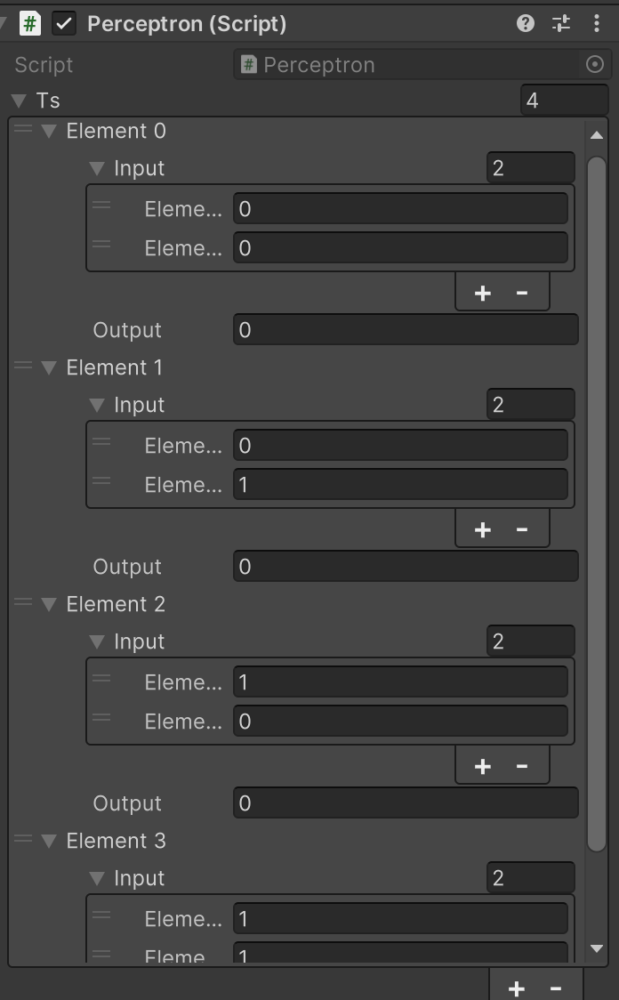
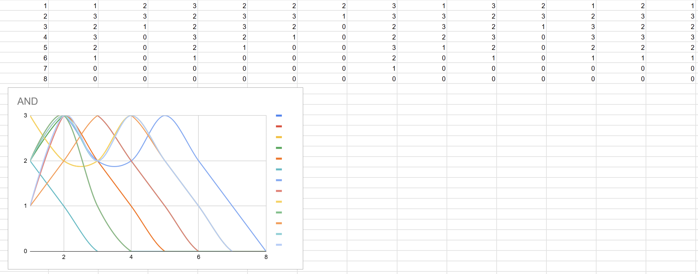

# АНАЛИЗ ДАННЫХ И ИСКУССТВЕННЫЙ ИНТЕЛЛЕКТ [in GameDev]
Отчет по лабораторной работе #4 выполнил(а):
- Маврешко Тимофей Кириллович
- РИ230940
Отметка о выполнении заданий (заполняется студентом):

| Задание | Выполнение | Баллы |
| ------ | ------ | ------ |
| Задание 1 | * | 60 |
| Задание 2 | * | 20 |
| Задание 3 | * | 20 |

знак "*" - задание выполнено; знак "#" - задание не выполнено;

Работу проверили:
- к.т.н., доцент Денисов Д.В.
- к.э.н., доцент Панов М.А.
- ст. преп., Фадеев В.О.

[](https://nodesource.com/products/nsolid)

[](https://travis-ci.org/joemccann/dillinger)

Структура отчета

- Данные о работе: название работы, фио, группа, выполненные задания.
- Цель работы.
- Задание 1.
- Код реализации выполнения задания. Визуализация результатов выполнения (если применимо).
- Задание 2.
- Код реализации выполнения задания. Визуализация результатов выполнения (если применимо).
- Задание 3.
- Код реализации выполнения задания. Визуализация результатов выполнения (если применимо).
- Выводы.
- ✨Magic ✨

## Цель работы
Изучить работу перцептрона с использованием среды Unity.


## Задание 1
### В проекте Unity реализовать перцептрон, который умеет производить вычисления OR, AND, NAND, XOR. Дать комментарии о корректности работы.
Ход работы:
- Первым делом сказаем скрипт Perceptron.cs, который нам понадобится для работы.
- Cоздадим новый Unity проект и добавим туда скачанный нами скрипт.
- Создадим четыре пустых объекта для каждой логической операции. Прикрепим на них скрипт и добавим в массив ts (training set) входные даннные и ожидаемые результаты этих логических операций.



- Выключим все объекты и, поочерёдно их включая, проверим работу перцептронов. Заметим, что они все, после нескольких эпох, рано или поздно, выводят правильные значения, за исколючением перцептрона XOR, иллюстрируя на практике проблему XOR. Для NAND при некоторых начальных весах и сдвиге не получается обучится за 8 эпох.


## Задание 2
### Построить графики зависимости количества эпох от ошибки обучения. Указать от чего зависит необходимое количество эпох обучения.

- Нескролько раз запустим каждый из перцерторов OR, AND и NAND и для каждого запуска пр. Мы увидим, что у всех них есть зависимость количества эпох от изначальной ошибки обучения. Конкретно, чем больше изначальная ошибка обучения, тем больше в среднем требуется эпох для обучения перцептрона.





- [Ссылка на таблицу](https://docs.google.com/spreadsheets/d/1ZMsjR9yw_mBtJg6mx9iojR8sU7tEjHPTay24Sa6bqeo/edit?gid=0#gid=0)


## Задание 3
### Построить визуальную модель работы перцептрона на сцене Unity

- В качестве визуализации сделаем каждый перцептрон в виде куба, высота которого равна ошибке обучения в данной эпохе. С каждым шагом кубы постепенно передвигаются вниз, пока не окажутся в синей зоне. Для этого немного перепишем код перцептрона.

```cs

using System.Collections;
using System.Collections.Generic;
using UnityEngine;

[System.Serializable]
public class TrainingSet
{
	public double[] input;
	public double output;
}

public class Perceptron : MonoBehaviour {

	public TrainingSet[] ts;
	double[] weights = {0,0};
	double bias = 0;
	double totalError = 0;
	double[] errorList = new double[8];
	int i = 0;
	float timer = 0.0f;

	double DotProductBias(double[] v1, double[] v2) 
	{
		if (v1 == null || v2 == null)
			return -1;
	 
		if (v1.Length != v2.Length)
			return -1;
	 
		double d = 0;
		for (int x = 0; x < v1.Length; x++)
		{
			d += v1[x] * v2[x];
		}

		d += bias;
	 
		return d;
	}

	double CalcOutput(int i)
	{
		double dp = DotProductBias(weights,ts[i].input);
		if(dp > 0) return(1);
		return (0);
	}

	void InitialiseWeights()
	{
		for(int i = 0; i < weights.Length; i++)
		{
			weights[i] = Random.Range(-1.0f,1.0f);
		}
		bias = Random.Range(-1.0f,1.0f);
	}

	void UpdateWeights(int j)
	{
		double error = ts[j].output - CalcOutput(j);
		totalError += Mathf.Abs((float)error);
		for(int i = 0; i < weights.Length; i++)
		{			
			weights[i] = weights[i] + error*ts[j].input[i]; 
		}
		bias += error;
	}

	double CalcOutput(double i1, double i2)
	{
		double[] inp = new double[] {i1, i2};
		double dp = DotProductBias(weights,inp);
		if(dp > 0) return(1);
		return (0);
	}

	void Train(int epochs)
	{
		InitialiseWeights();
		
		for(int e = 0; e < epochs; e++)
		{
			totalError = 0;
			for(int t = 0; t < ts.Length; t++)
			{
				UpdateWeights(t);
				Debug.Log("W1: " + (weights[0]) + " W2: " + (weights[1]) + " B: " + bias);
			}
			Debug.Log("TOTAL ERROR: " + totalError);
			errorList[e] = totalError;
		}
	}

	void Start () {
		Train(8);
		Debug.Log("Test 0 0: " + CalcOutput(0,0));
		Debug.Log("Test 0 1: " + CalcOutput(0,1));
		Debug.Log("Test 1 0: " + CalcOutput(1,0));
		Debug.Log("Test 1 1: " + CalcOutput(1,1));	
	}
	
	void Update () {
		timer += Time.deltaTime;
		if (timer >= 0.5f && i < 8) {
			timer = 0f;
			transform.position = new Vector3(transform.position.x, (float)errorList[i], transform.position.z);
			i++;
		}
	}
}

```

- Результат:


## Выводы

Изучили работу перцептрона с использованием среды Unity.

Все созданные в ходе работы программы доступны в этой репозитории в папке workshop-projects.

| Plugin | README |
| ------ | ------ |
| Dropbox | [plugins/dropbox/README.md][PlDb] |
| GitHub | [plugins/github/README.md][PlGh] |
| Google Drive | [plugins/googledrive/README.md][PlGd] |
| OneDrive | [plugins/onedrive/README.md][PlOd] |
| Medium | [plugins/medium/README.md][PlMe] |
| Google Analytics | [plugins/googleanalytics/README.md][PlGa] |

## Powered by

**BigDigital Team: Denisov | Fadeev | Panov**
