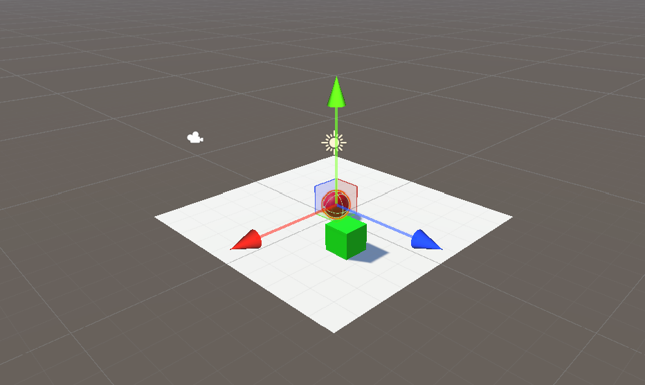
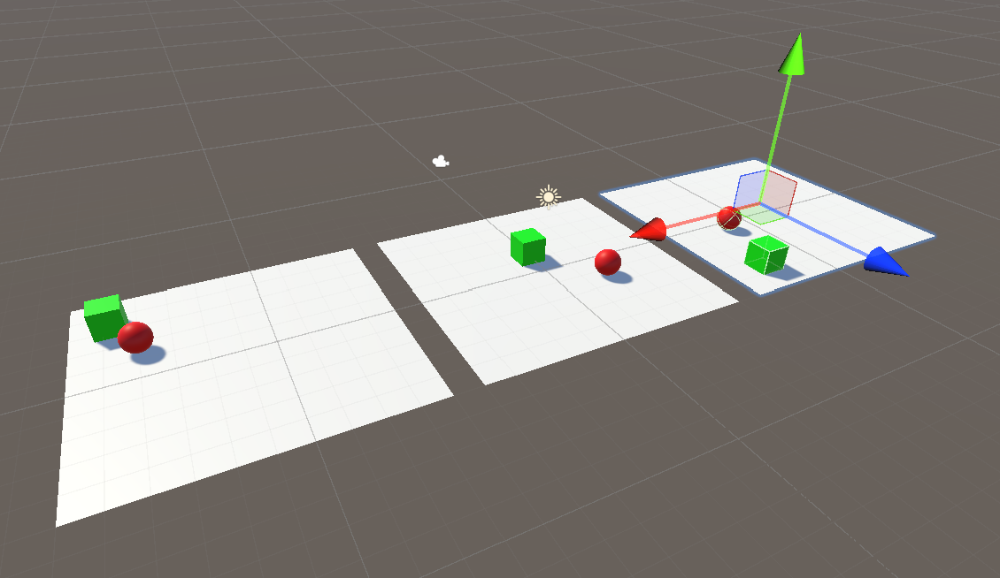
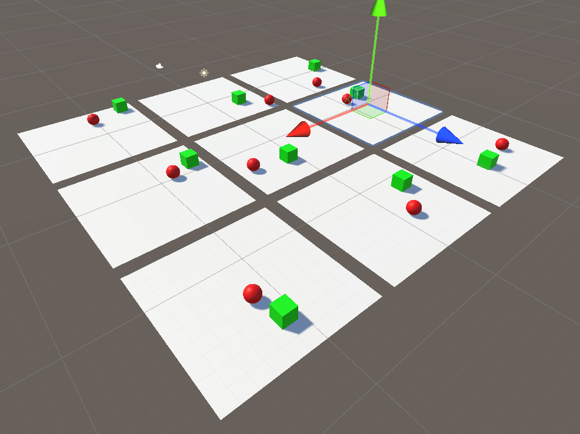
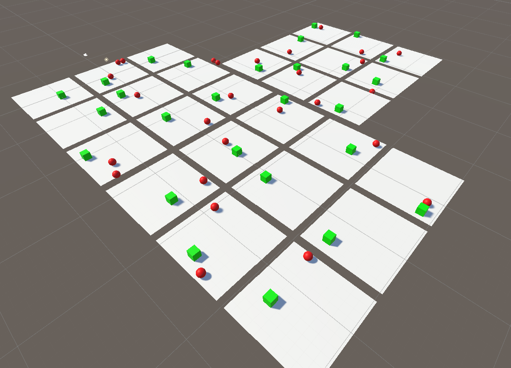
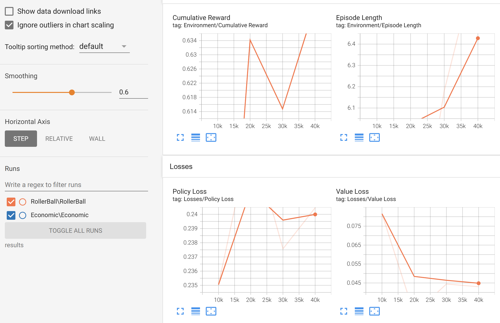

# АНАЛИЗ ДАННЫХ И ИСКУССТВЕННЫЙ ИНТЕЛЛЕКТ [in GameDev]
Отчет по лабораторной работе #5 выполнил(а):
- Маврешко Тимофей Кириллович
- РИ230940
Отметка о выполнении заданий (заполняется студентом):

| Задание | Выполнение | Баллы |
| ------ | ------ | ------ |
| Задание 1 | * | 60 |
| Задание 2 | * | 20 |
| Задание 3 | * | 20 |

знак "*" - задание выполнено; знак "#" - задание не выполнено;

Работу проверили:
- к.т.н., доцент Денисов Д.В.
- к.э.н., доцент Панов М.А.
- ст. преп., Фадеев В.О.

Структура отчета

- Данные о работе: название работы, фио, группа, выполненные задания.
- Цель работы.
- Задание 1.
- Код реализации выполнения задания. Визуализация результатов выполнения (если применимо).
- Задание 2.
- Код реализации выполнения задания. Визуализация результатов выполнения (если применимо).
- Задание 3.
- Код реализации выполнения задания. Визуализация результатов выполнения (если применимо).
- Выводы.
- ✨Magic ✨

## Цель работы
Познакомиться с программными средствами для создания системы машинного обучения и ее интеграции в Unity.

## Задание 1
### Найти внутри C# скрипта “коэффициент корреляции ” и сделать выводы о том, как он влияет на обучение модели.
- Следуя указаниям в лабораторной работе, создадим проект в Unity и добавим в него ML агента. Запустим обучение, и заметим, как со временем шар начинает всё точнее следовать за зелёной целью.

- В TensorFlow посмотрим данные процесса обучения.

- Коофицентом корреляции в контексте агента является значение награды *m_Reward* в скрипте *Agent.cs*, которое даётся агенту после каждой итерации в зависимости от его успешности. Оно может принимать любое значение от -1 до 1. Положительные значения поощряют агента, давая ему продвинуться в следующую итерацию, отрицательные - наоборот.

## Задание 2
### Изменить параметры файла yaml-агента и определить какие параметры и как влияют на обучение модели. Привести описание не менее трех параметров.

- **extrinsic:** Указывает, насколько внешнее поощрение должно влиять на обучение агента. Имеет два подпараметра: **strength** и **gamma**. strength является обычным коофицентом, на который умножается внешняя награда, gamma определяет, насколько далекие в будущем награды будут влиять на принятие решений.
- **max_steps:** Указывает, сколько шагов проводить обучение. Чем больше значение, тем дольше будет продолжаться обучение.
- **num_layers:** Определяет количество скрытых слоёв в нейронной сети. Тем больше число, тем глубже и сложнее модель.

## Задание 3
### Привести примеры, для каких игровых задачи и ситуаций могут использоваться примеры 1 и 2 с ML-Agent’ом. В каких случаях проще использовать ML-агент, а не писать программную реализацию решения?

- Первый агент может использоваться в условиях, когда нвдо максимально быстро преследовать что-то в условиях плавного ускорения, например, в гоночных симуляторах.
- Второй агент может использоваться для игры-стратегии для управления юнитом, собирающем ресурсы как, например, рабочие в игре StarCraft.
- Если логика NPC достаточно проста, то лучше, естественно, использовать вручную написанный алгоритм. Однако, если, например, написание алгоритма слишком сложное, или необходимо имитировать действия игроков (как, например, компьютерные оппоненты в многопользовательских играх), то проще использовать ML-агента.

## Выводы

Познакомились с программными средствами для создания системы машинного обучения и ее интеграции в Unity.

Все созданные в ходе работы программы доступны в этой репозитории в папке workshop-projects.

| Plugin | README |
| ------ | ------ |
| Dropbox | [plugins/dropbox/README.md][PlDb] |
| GitHub | [plugins/github/README.md][PlGh] |
| Google Drive | [plugins/googledrive/README.md][PlGd] |
| OneDrive | [plugins/onedrive/README.md][PlOd] |
| Medium | [plugins/medium/README.md][PlMe] |
| Google Analytics | [plugins/googleanalytics/README.md][PlGa] |

## Powered by

**BigDigital Team: Denisov | Fadeev | Panov**
